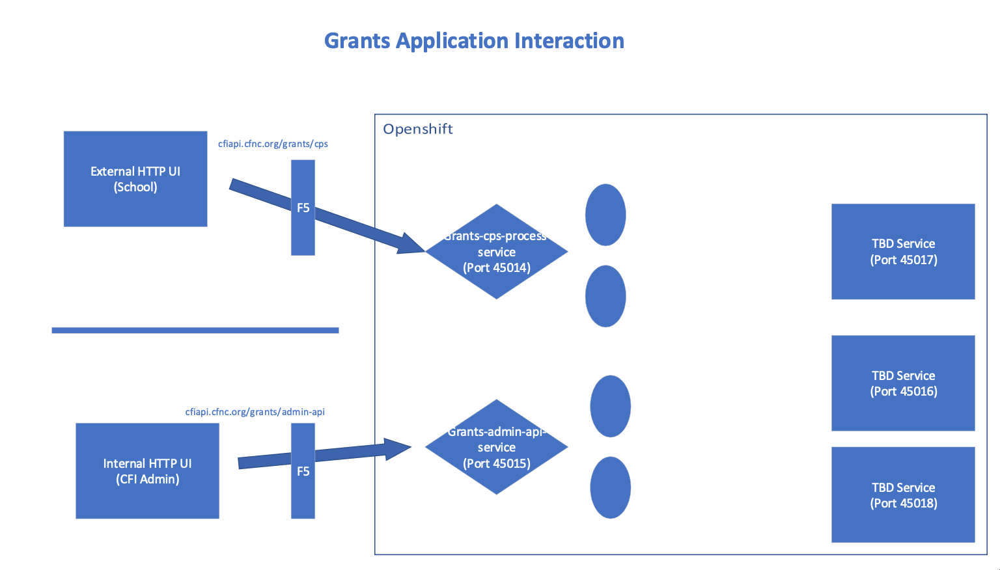

# CFI Grants Applicatoin Deployment on OpenShift

- [CFI Grants Applicatoin Deployment on OpenShift](#cfi-grants-applicatoin-deployment-on-openshift)
    - [Prerequisites](#prerequisites)
    - [Application Manifests Deployment](#application-manifests-deployment)
        - [Grants Process CPS manifests](#grants-process-cps-manifests)
        - [Grants Admin API manifests](#grants-admin-api-manifests)
    
<div style="page-break-after: always;"></div>

CFI Grants Application consists of 5 microservices. Currently below 2 microservices will be deployed in same namespace of OpenShift cluster. 

**Microservices:**
- Grants Process CPS
- Grants Admin API



### Prerequisites

Grants Application Deployment Prereqs
- OpenShift cluster installation and configuration completed successfully
- Grants Application microservices container images are available on Nexus Repo Docker Private Registry 

### Application Manifests Deployment

#### Grants Process CPS manifests

- Grants Process CPS microservice consists of below Kubernetes objects:
    - Deployment
    - Services
    - Pods
    - Configmaps
    - Secrets
    - Routes (Optional: Currently App required APIs external access is configured via F5 BIG IP implementation on OpenShift)

<details>
<summary>Deployment</summary>

```yaml
# grants-process-cps-deployment.yaml
apiVersion: apps/v1
kind: Deployment
metadata:
labels:
    app: grants-process-cps
name: grants-process-cps
spec:
replicas: 1
selector:
    matchLabels:
    app: grants-process-cps
strategy: {}
template:
    metadata:
    labels:
        app: grants-process-cps
    spec:
    containers:
    # - env:
    #     - name: BROKER_HOST
    #       value: t0b-kafq01.cfi.local:9092,t0b-kafq02.cfi.local:9092,t0b-kafq03.cfi.local:9092
    #     - name: DB_HOST
    #       value: r0m-dbmq02.ncmentor.local
    #     - name: DB_NAME
    #       value: grants
    #     - name: DB_PASSWORD
    #       value: S8llta55PTLkUNWKPl1m
    #     - name: DB_PORT
    #       value: "1086"
    #     - name: DB_USER
    #       value: qa_grants
    #     - name: MAIL_HOST
    #       value: mail.cfi.org
    #     - name: MAIL_PORT
    #       value: "25"
    - envFrom:
        - configMapRef:
            name: grants-process-cps-configmap # grants process cps configmap reference
        - secretRef:
            name: grants-process-cps-secret # grants process cps secret reference
        image: cfidockerreg.cfi.local/grants-process-cps:0.1.0-SNAPSHOT # container image from Nexus Repo 
        name: grants-process-cps
        ports:
            - containerPort: 8080
        resources:
            limits:
            cpu: 2000m
            memory: 4Gi 
            requests:
            cpu: 1000m
            memory: 2Gi
```
</details>

<details>
<summary>Service</summary>

```yaml
# grants-process-cps-service.yaml
apiVersion: v1
kind: Service
metadata:
  labels:
    app: grants-process-cps
  name: grants-process-cps
spec:
  ports:
    - name: "45014"
      port: 45014
      targetPort: 8080
  selector:
    app: grants-process-cps
```
</details>

<details>
<summary>Configmap</summary>

```yaml
# grants-process-cps-configmap.yaml
apiVersion: v1
kind: ConfigMap
metadata:
  name: grants-process-cps-configmap
data:
  BROKER_HOST: t0b-kafq01.cfi.local:9092,t0b-kafq02.cfi.local:9092,t0b-kafq03.cfi.local:9092
  DB_HOST: r0m-dbmq02.ncmentor.local
  DB_NAME: grants
  DB_PORT: "1086"
  # DB_USER: qa_grants
  MAIL_HOST: mail.cfi.org
  MAIL_PORT: "25"
```
</details>

<details>
<summary>Secret</summary>

```yaml
# grants-process-cps-secret.yaml
apiVersion: v1
kind: Secret
metadata:
  name: grants-process-cps-secret
type: Opaque
data:
  DB_USER: cWFfZ3JhbnRz
  DB_PASSWORD: <db-password> # base64 encoded value 
```
</details>

- Create `qagrantsapps` namespace on OpenShift
    
    ```bash
    $ oc new-project qagrantsapps
    ```
- Deploy Grants Process CPS App Manifests using `oc` command line 

    ```bash
    $ oc apply -f grants-process-cps-deployment.yaml
    $ oc apply -f grants-process-cps-service.yaml
    $ oc apply -f grants-process-cps-configmap.yaml
    $ oc apply -f grants-process-cps-secret.yaml
    ```

- To Deploy `Grants App` using Argo CD, follow [Deploy Application using Argo CD](/Post-Installation/07-OpenShift-GitOps-Installation-Configuration.MD#prepare-cluster-namespace-for-app-deployment-using-argo-cd)

#### Grants Admin API manifests

- Grants Admin API microservice consists of below Kubernetes objects:
    - Deployment
    - Services
    - Pods
    - Configmaps
    - Secrets
    - Routes (Optional: Currently App required APIs external access is configured via F5 BIG IP implementation on OpenShift)

<details>
<summary>Deployment</summary>

```yaml
# grants-admin-api-deployment.yaml
```
</details>

<details>
<summary>Service</summary>

```yaml
# grants-admin-api-service.yaml
```
</details>

<details>
<summary>Configmap</summary>

```yaml
# grants-admin-api-configmap.yaml
```
</details>

<details>
<summary>Secret</summary>

```yaml
# grants-admin-api-secret.yaml
```
</details>

- Create `qagrantsapps` namespace on OpenShift
    
    ```bash
    $ oc new-project qagrantsapps
    ```
- Deploy Grants Process CPS App Manifests using `oc` command line 

    ```bash
    $ oc apply -f grants-admin-api-deployment.yaml
    $ oc apply -f grants-admin-api-service.yaml
    $ oc apply -f grants-admin-api-configmap.yaml
    $ oc apply -f grants-admin-api-secret.yaml
    ```

- To Deploy `Grants App` using Argo CD, follow [Deploy Application using Argo CD](/Post-Installation/07-OpenShift-GitOps-Installation-Configuration.MD#prepare-cluster-namespace-for-app-deployment-using-argo-cd)