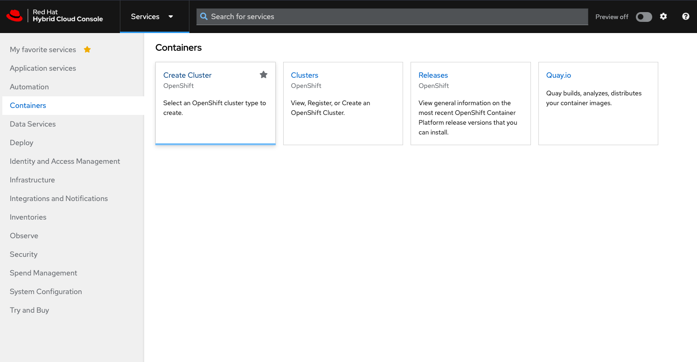
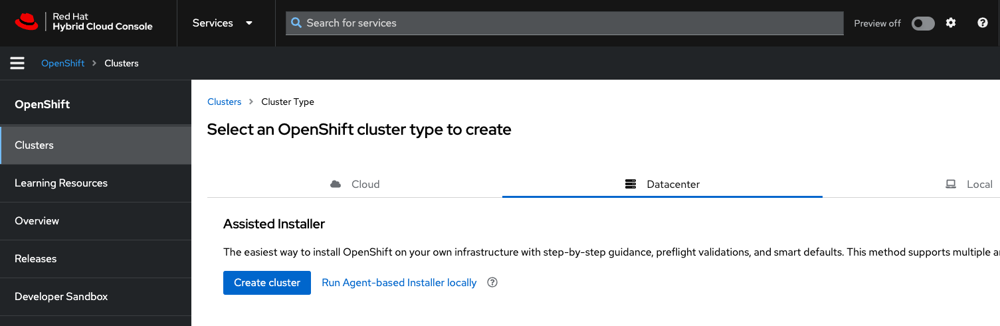
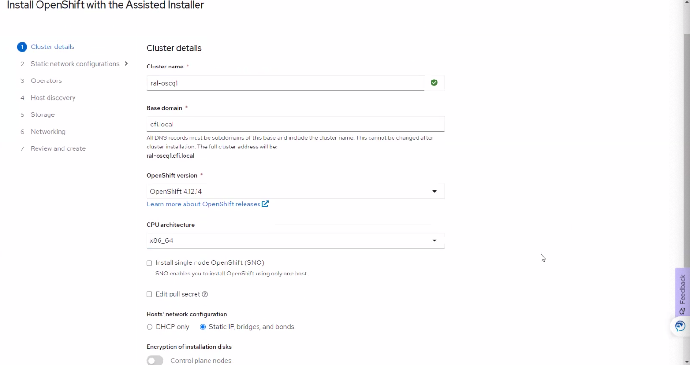
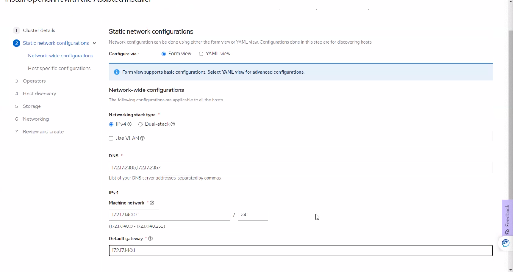
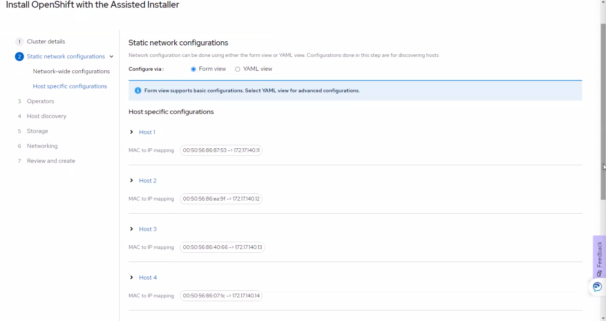
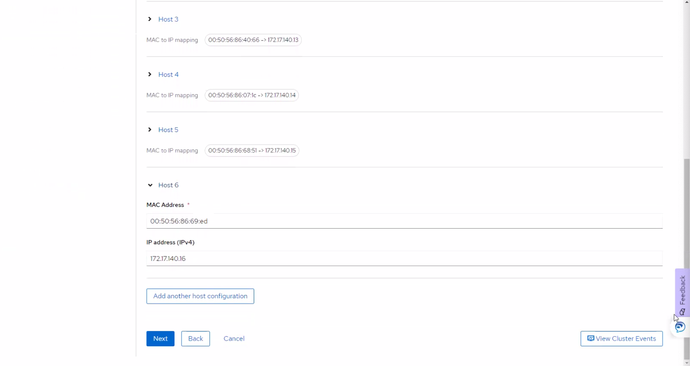
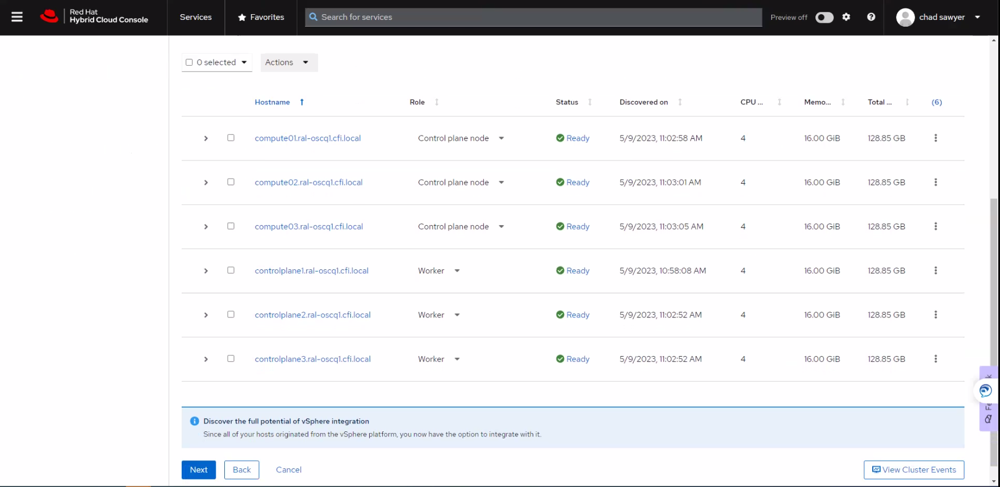

# OpenShift Installation with Assisted Installer method 

- [OpenShift Installation with Assisted Installer method](#openshift-installation-with-assisted-installer-method)
  - [1. Start Installation](#1-start-installation)
    - [1.1 Pre-installation considerations](#11-pre-installation-considerations)
    - [1.2 Setting the cluster details](#12-setting-the-cluster-details)
    - [1.3 Configuring static networks](#13-configuring-static-networks)
    - [1.4 Adding hosts to the cluster](#14-adding-hosts-to-the-cluster)
    - [1.5 Configuring hosts](#15-configuring-hosts)
    - [1.6 Configuring networking](#16-configuring-networking)
    - [1.7 Installing the cluster](#17-installing-the-cluster)
    - [1.8 Final steps](#18-final-steps)

## 1. Start Installation

After provided cluster nodes and network requirements are in place, you can begin installing the cluster.

### 1.1 Pre-installation considerations

- Which base domain to use and cluster name
- Which OpenShift Container Platform product version to install
- Whether to install a full cluster or single-node OpenShift
- Whether to use a DHCP server or a static network configuration
- Whether to use IPv4 or dual-stack networking
- Whether to install OpenShift Virtualization
- Whether to install Red Hat OpenShift Data Foundation
- Whether to integrate with the platform when installing on vSphere or not 

### 1.2 Setting the cluster details 

To create a cluster with Assisted Installer UI, please follow below steps:

- Log in to **Red Hat Hybrid Cloud Console**  `console.redhat.com`.
- In the menu, click **OpenShift**.
- Click **Create cluster**.

- Click the **Datacenter** tab.
- Under the **Assisted Installer** section, select **Create cluster**.

- Enter a name for the cluster in the **Cluster name** field.
- Enter a base domain for the cluster in the **Base domain** field. All subdomains for the cluster will use this base domain.
- Select the version of OpenShift Container Platform to install.

>  Optional: The Assisted Installer already has the pull secret associated to your account. If you want to use a different pull secret, select **Edit pull secret**.

- Select **Static IP, bridges, and bonds**.


> Optional: If you want to enable encryption of the installation disks, under **Enable encryption of installation disks**, you can select Control plane nodes to encrypt the control plane node installation disks and select Workers to encrypt worker node installation disks.
  

### 1.3 Configuring static networks 

The Assisted Installer supports IPv4 networking with **SDN** and **OVN**, and supports IPv6 and dual stack networking with OVN only. 

The Assisted Installer supports configuring the network with static network interfaces with IP address/MAC address mapping. 

The Assisted Installer also supports configuring host network interfaces with the NMState library, a declarative network manager API for hosts. You can use NMState to deploy hosts with static IP addressing, bonds, VLANs and other advanced networking features. 

- Select the internet protocol version. Valid options are **IPv4** and **Dual stack**.
- Enter the network-wide IP addresses. 
  - Enter the cluster network’s IP address range in **CIDR** notation.
  - Enter the **default gateway** IP address.
  - Enter the **DNS server** IP addresss.
  
- Enter the host-specific configuration.
  - For a static IP address that uses a single network interface, use the form view to enter the IP address and the MAC address for each host.



### 1.4 Adding hosts to the cluster 

This step will require generating a discovery ISO. The discovery ISO runs Red Hat Enterprise Linux CoreOS (RHCOS) in-memory with an agent. 

- Click the **Add hosts** button and select the installation media.
- Select **Full image file: Provision with physical media** to download the larger full image.
- Optional: If the cluster hosts are behind a firewall that requires the use of a proxy, select **Configure cluster-wide proxy settings**. Enter the username, password, IP address and port for the HTTP and HTTPS URLs of the proxy server.
- Add an SSH public key so that you can connect to the cluster nodes as the core user. 
- Click **Generate Discovery ISO**.
- Download the discovery ISO.
- Boot the host(s) with the discovery image.

### 1.5 Configuring hosts

After booting each cluster nodes with the discovery ISO, the hosts will appear in Red Hat Hybrid Cloud console UI. 

- Select a host.
- From **Actions** list, select **Change hostname**. Ensure each host has a valid and unique hostname. If necessary, enter a new name for the host and click **Change**. 
- In the **Role** column, change the role of the host. 
- Click expand the host details. Add **NTP source** detail.
- Repeat this procedure for each host.

Once all cluster hosts appear with a **ready** status, proceed to the next step.



### 1.6 Configuring networking 

To continue OpenShift cluster installation, configure cluster network, Ingress and API VIP.

- Select **Cluster-Managed Networking**

  > Selecting cluster-managed networking means that the Asisted Installer will configure a standard network topology, including `keepalived` for managing the API and Ingress VIP addresses. 

- For cluster-managed networking, provide below details:
  - Define the **Machine network**. You can use the default network or select a subnet.
  - Define an **API virtual IP** -> An API virtual IP provides an endpoint for all users to interact with, and configure the platform. 
  - Define an **Ingress virtual IP** -> An Ingres virtual IP provides an endpoint for application traffic flowing from outside the cluster. 

- Select **Use advanced networking** 
  - Select **Network type**: **Open Virtual Networking** 
  - Leave all other settings as default. 

### 1.7 Installing the cluster

After completing all the configuration and all the nodes are **Ready**, you can begin cluster installation. 

- Click **Begin installation**.
- Continue to monitor cluster installation from Assisted Installer UI.

### 1.8 Final Steps

After the cluster is installed and initialized, the Assisted Installer provides console URL, `kubeadmin` username and password, and `kubeconfig` file including additional cluster related information. 

- Make a copy of `kubeadmin` username and password.

  > Safely store `kubeadmin` password in a secure vault and don't use it for day-to-day activities of Cluster Administration.

- Download `kubeconfig` file and copy it to the `auth` directory under your working directory. 

  > `kubeconfig` file is available for download for 24 hours after completing installation.

- Login with `oc` CLI tool
  
  `oc login -u kubeadmin -p <password>`

- Verify cluster operators status. All operators should be in available state.

  ```bash
  # oc get co
  NAME                                       VERSION   AVAILABLE   PROGRESSING   DEGRADED   SINCE   MESSAGE
  authentication                             4.12.15   True        False         False      2d11h
  baremetal                                  4.12.15   True        False         False      72d
  cloud-controller-manager                   4.12.15   True        False         False      72d
  cloud-credential                           4.12.15   True        False         False      72d
  cluster-autoscaler                         4.12.15   True        False         False      72d
  config-operator                            4.12.15   True        False         False      72d
  console                                    4.12.15   True        False         False      61d
  control-plane-machine-set                  4.12.15   True        False         False      72d
  csi-snapshot-controller                    4.12.15   True        False         False      72d
  dns                                        4.12.15   True        False         False      72d
  etcd                                       4.12.15   True        False         False      72d
  image-registry                             4.12.15   True        False         False      13d
  ingress                                    4.12.15   True        False         False      64d
  insights                                   4.12.15   True        False         False      72d
  kube-apiserver                             4.12.15   True        False         False      72d
  kube-controller-manager                    4.12.15   True        False         False      72d
  kube-scheduler                             4.12.15   True        False         False      72d
  kube-storage-version-migrator              4.12.15   True        False         False      13d
  machine-api                                4.12.15   True        False         False      72d
  machine-approver                           4.12.15   True        False         False      72d
  machine-config                             4.12.15   True        False         False      72d
  marketplace                                4.12.15   True        False         False      72d
  monitoring                                 4.12.15   True        False         False      72d
  network                                    4.12.15   True        False         False      72d
  node-tuning                                4.12.15   True        False         False      72d
  openshift-apiserver                        4.12.15   True        False         False      72d
  openshift-controller-manager               4.12.15   True        False         False      72d
  openshift-samples                          4.12.15   True        False         False      72d
  operator-lifecycle-manager                 4.12.15   True        False         False      72d
  operator-lifecycle-manager-catalog         4.12.15   True        False         False      72d
  operator-lifecycle-manager-packageserver   4.12.15   True        False         False      72d
  service-ca                                 4.12.15   True        False         False      72d
  storage                                    4.12.15   True        False         False      70d
  ```

- Follow Post Installation docs for additional Cluster configuration. 