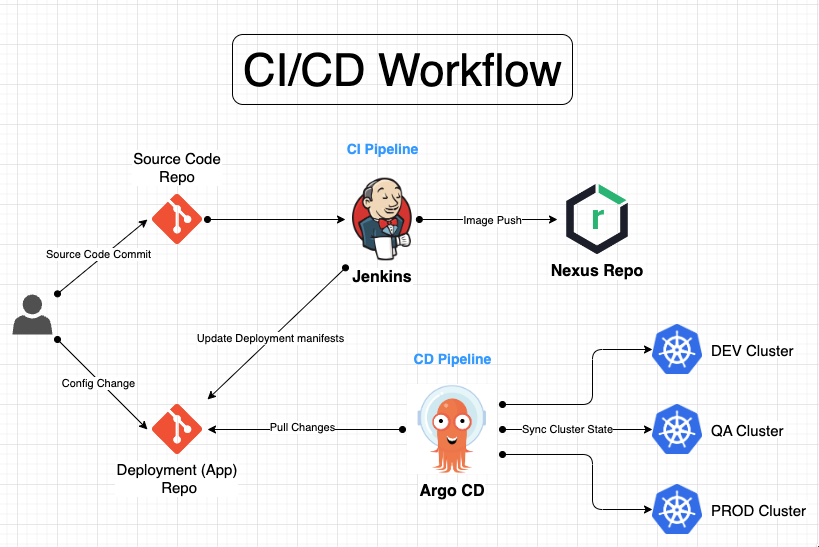

# OpenShift GitOps Installation and Configuration

- [OpenShift GitOps Installation and Configuration](#openshift-gitops-installation-and-configuration)
    - [Installing Red Hat OpenShift GitOps](#installing-red-hat-openshift-gitops)
    - [Login to Argo CD UI](#login-to-argo-cd-ui)
    - [Add Private Repo to Argo CD](#add-private-repo-bitbucket-to-argo-cd)
    - [Prepare Cluster Namespace for App Deployment using Argo CD](#prepare-cluster-namespace-for-app-deployment-using-argo-cd)
    - [Setup Argo CD Notification](#setup-argo-cd-notification)
    - [Configuring Argo CD RBAC](#configuring-argo-cd-rbac)
    
<div style="page-break-after: always;"></div>

GitOps is a declarative way to implement continuous deployment for cloud native applications. You can use GitOps to create repeatable processes for managing OpenShift Container Platform applications across multi-cluster Kubernetes environments. GitOps handles and automates complex deployments at a fast pace, saving time during deployment and release cycles.

GitOps is a set of practices that use Git pull requests to manage application configurations. In GitOps, the Git repository is the only source of truth for system and application configuration. 


### Installing Red Hat OpenShift GitOps 

Install Red Hat OpenShift GitOps Operator using web console

1. Open the **Administrator** perspective of the web console and navigate to **Operators** → **OperatorHub** in the menu on the left.
2. Search for `OpenShift GitOps`, click the **Red Hat OpenShift GitOps** tile, and then click **Install**.
3. Ensure that all pods in the `openshift-gitops` namespace are running.

    ```bash
    $ oc get pods -n openshift-gitops
    ```

Red Hat OpenShift GitOps will be installed in all namespaces of the cluster.

After the Red Hat OpenShift GitOps Operator is installed, it automatically sets up a ready-to-use Argo CD instance that is available in the `openshift-gitops` namespace, and an Argo CD icon is displayed in the console toolbar. You can create subsequent Argo CD instances for your applications under your projects.

### Login to Argo CD UI

1. From OpenShift web console, navigate to menu → **OpenShift GitOps** → **Cluster Argo CD**. The login page of Argo CD UI is displayed in a new window.
2. Obtain password for Argo CD instance. 
    ```bash
    $ oc extract secret/openshift-gitops-cluster -n openshift-gitops --to=-
    ```

### Add Private Repo (Bitbucket) to Argo CD 

1. Login to Argo CD instance from command line

    ```bash
    $ export ARGOCD_SERVER_URL=$(oc get routes -n openshift-gitops | grep openshift-gitops-server | awk '{print $2}')
    $ argocd login $ARGOCD_SERVER_URL

    Username: admin
    Password: <use obtain password from previous step>
    ```

2. Add Repo to Argo CD

    ```bash
    $ argocd repo add https://bitbucket.org/cfiapps/openshift-apps.git --proxy http://r0b-prxy06.cfi.local:8080
    ```
    > Note: Configure `App Password` on Bitbucket for Repo Authentication

### Prepare Cluster Namespace for App Deployment using Argo CD

1. Label respective namespace for App Deployment

    ```bash
    $ oc label namespace <namespace> argocd.argoproj.io/managed-by=openshift-gitops
    ```
2. Assign the `admin` role to the `argocd-application-controller` service account within the designated application `namespace`

    ```bash
    $ oc adm policy add-role-to-user admin system:serviceaccount:openshift-gitops:openshift-gitops-argocd-application-controller -n qagrantsapps
    ```
3. Deploy Application using Argo CD UI
    
    - In the Argo CD dashboard, click **NEW APP** to add a new Argo CD application.
    
    - For this workflow, create a `qagrantsapps` application with the following configurations:
        
        **Application Name**: `qagrantsapps`
        
        **Project**: `default`
        
        **Sync Policy**: `Manual`
        
        **Repository URL**: https://bitbucket.org/cfiapps/openshift-apps.git

        **Revision**: `HEAD`
        
        **Path**: `apps/qa`
        
        **Destination**: https://kubernetes.default.svc

        **Namespace**: `qagrantsapps`

        **Directory Recurse**: `checked`

    - Click **CREATE** to create your application.

4. Deploy Applicatoin using CLI

    - Prepare Argo Application definition as below for App Deployment
        
        ```yaml
        # cat app.yaml
        apiVersion: argoproj.io/v1alpha1
        kind: Application
        metadata:
        name: grants-apps
        annotations:
            notifications.argoproj.io/subscribe.on-sync-succeeded.email: smathur@cfi.org # notification recipient email 
        spec:
        destination:
            name: ''
            namespace: qagrantsapps
            server: 'https://kubernetes.default.svc'
        source:
            path: app-manifest/qa
            repoURL: 'https://bitbucket.org/cfiapps/openshift-apps.git'
            targetRevision: HEAD
            directory:
            recurse: true
        sources: []
        project: default
        syncPolicy:
            syncOptions:
            - CreateNamespace=true
        ```

    - Create the application
        
        ```bash
        $ oc apply -f app.yaml -n openshift-gitops
        ```
### Setup Argo CD Notification 

1. Enable Argo CD notification for OpenShift GitOps Argo CD instance
    ```yaml
    # oc edit argocd -n openshift-gitops

    apiVersion: v1
    items:
    - apiVersion: argoproj.io/v1alpha1
        kind: ArgoCD
        metadata:
        creationTimestamp: "2023-07-07T00:07:55Z"
        finalizers:
            - argoproj.io/finalizer
        generation: 3
        name: openshift-gitops
        namespace: openshift-gitops
        ownerReferences:
            - apiVersion: pipelines.openshift.io/v1alpha1
            blockOwnerDeletion: true
            controller: true
            kind: GitopsService
            name: cluster
            uid: 20562178-9618-4aa4-b5c7-849c39b6d84f
        resourceVersion: "100318982"
        uid: 5e8d249f-5f20-4eec-875f-b803c81dac7c
        spec:
        ...
        ...
        notifications:
            enabled: true # set this value to true
        ...
    ```
2. Check `openshift-gitops` namespace for Argo CD notification pod getting created
    
    ```bash
    NAME                                                         READY   STATUS    RESTARTS   AGE
    cluster-6b8c7b49f-sqhj8                                      1/1     Running   0          15d
    kam-59fd558fcb-tpk2v                                         1/1     Running   0          15d
    openshift-gitops-application-controller-0                    1/1     Running   0          15d
    openshift-gitops-applicationset-controller-7d5bf7f69-88k5d   1/1     Running   0          15d
    openshift-gitops-dex-server-58bcdd76b9-2jlcm                 1/1     Running   0          15d
    openshift-gitops-notifications-controller-85dfb6867-wf8pz    1/1     Running   0          15d
    openshift-gitops-redis-bb656787d-v5rzv                       1/1     Running   0          26d
    openshift-gitops-repo-server-66f6c4bf69-ckfgw                1/1     Running   0          15d
    openshift-gitops-server-7765574d88-74782                     1/1     Running   0          15d
    ```

3. Create Argo CD notification `secret` and `configmap`

    **Argo CD notification secret**

    ```yaml
    apiVersion: v1
    kind: Secret
    metadata:
        name: argocd-notifications-secret
    stringData:
        email-username: "smathur@cfi.org"
    ```

    **Argo CD notification configmap**

    ```yaml
    apiVersion: v1
    kind: ConfigMap
    metadata:
    name: argocd-notifications-cm
    data:
    service.email: |
        host: mail.cfi.org
        port: 25
        from: $email-username
    context: |
        argocdUrl: https://openshift-gitops-server-openshift-gitops.apps.ral-oscq1.cfi.local
    trigger.on-sync-succeeded: |
        - description: Application syncing has succeeded
        send:
        - app-sync-succeeded
        when: app.status.operationState.phase in ['Succeeded']
    template.app-sync-succeeded: |
        email:
            subject: Application "{{.app.metadata.name}}" has been successfully synced.
        message: |
            {{if eq .serviceType "slack"}}:white_check_mark:{{end}} Application "{{.app.metadata.name}}"" has been successfully synced at {{.app.status.operationState.finishedAt}}.
            
            Sync operation details are as below:
            - Application "{{.app.metadata.name}}" sync status is {{.app.status.sync.status}}.
            - Application details: {{.context.argocdUrl}}/applications/{{.app.metadata.name}}.
            - Application repository: {{.app.spec.source.repoURL}}.
            - Application revision: {{.app.status.sync.revision}}.
    ```

### Configuring Argo CD RBAC

By default, if you are logged into Argo CD using RHSSO, you are a read-only user. You can change and manage the user level access.

1. Configuring user level access.
    
    ```bash
    $ oc edit argocd -n openshift-gitops
    ```
    
    ```yaml
    apiVersion: v1
    items:
    - apiVersion: argoproj.io/v1alpha1
        kind: ArgoCD
        metadata:
        ...
        ...
        rbac:
            policy: |
            g, system:cluster-admins, role:admin
            g, cluster-admins, role:admin
            g, administrators, role:admin # OpenShift "administrators" group have "admin" privileges on Argo CD 
            g, developers, role:readonly # OpenShift "developers" group have "readonly" privileges on Argo CD 
            scopes: '[groups]'
    ```

> Note: OpenShift IDP (LDAP or htpasswd) configuration needs to be completed to use OpenShift GitOps RBAC

2. Login to Argo CD instance and verify access.
