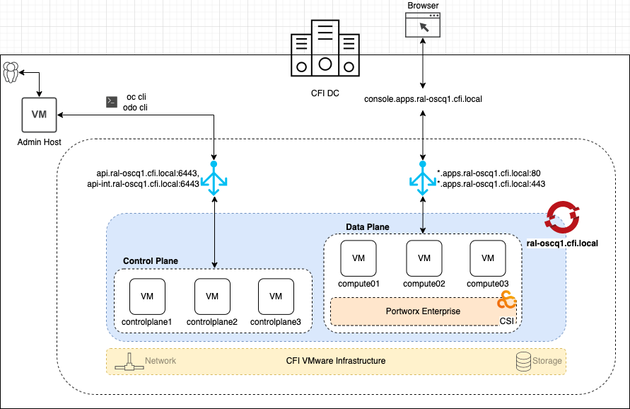

# Infrastructure Requirements

- [Infrastructure Requirements](#infrastructure-requirements)
  - [1. OpenShift UAT Cluster Architecture](#1-cfi---openshift-uat-cluster-architecture)
  - [2. VMware vSphere Requirements](#2-vmware-vsphere-requirements)
  - [3. Machine Requirements](#3-machine-requirements)
  - [4. Network Requirements](#4-network-requirements)
    - [4.1 Ports to be open between OCP Cluster machines](#41-ports-to-be-open-between-ocp-cluster-machines)
    - [4.2 DHCP Requirements](#42-dhcp-requirements)
    - [4.3 DNS Requirements](#43-dns-requirements)
  - [5. vCenter User Permissions and Setup](#5-vcenter-user-permissions-and-setup)
  - [6. Red Hat Subscriptions](#6-red-hat-subscriptions)

## 1. CFI - OpenShift UAT Cluster Architecture

## 2. VMware vSphere Requirements

- Version requirements for vSphere virtual environments

  | Virtual environment product | Required version |
  |--|--|
  | VMware virtual hardware | 15 or later  |
  | vSphere ESXi hosts | 7.0 Update 2 or later  |
  | vCenter host | 7.0 Update 2 or later  |

  | Component | Minimum supported versoins |
  |--|--|
  | Hypervisor | vSphere 7.0 Update 2 and later with virtual hardware version 15  |
  | Storage with in-tree drivers | vSphere 7.0 Update 2 and later  |
  | Optional: Networking (NSX-T) | vSphere 7.0 Update 2 or later  |

- Internet acess for Openshift Container Platform
  - Access to OpenShift Cluster Manger Hybrid Cloud Console to download installation program and perform subscription management.
  - Acces to below registries to obtain container images and packages that are required to install cluster.
    - regsitry.redhat.io
    - quay.io
    - docker.io

- OpenShift Container Platform installer requiers access to port 443 on the vCenter and ESXi hosts.
- Access to NTP server for time synchronization between cluster nodes.
- Persistent Storage for cluster. To deploy a private image registry, provided storage must provide `ReadWriteMany` access modes.

## 3. Machine Requirements

- Minimum cluster must include the following:
  - 1 temporary bootstrap node (not needed for Assisted Installer method)
  - 1 bastion host 
  - 3 control plane nodes (masters)
  - 2 compute nodes (workers) (for CFI **UAT** cluster, we will be creating 3 compute nodes)

The minimum specs for machines installed are as follows:

| Node Type | OS | Count | vCPU | RAM (in GB) | Storage (in GB) |
|--|--|--|--|--|--|
| Control Plane | RHCOS  | 3 | 4 | 16 GB | 120 GB |
| Compute | RHCOS  | 3 | 8 | 16 GB | 120 GB |
| Bastion | RHEL 8.x  | 1 | 2 | 8 GB | 80 GB |

## 4. Network Requirements

### 4.1 Ports to be open between OCP Cluster machines

| Protocol | Port | Description |
|--|--|--|
| **ICMP** | N/A | Network reachability tests |
| **TCP** | `2379`-`2380` | etcd server and peer ports |
| | `6443` | Kubernetes API |
| | `1936` | Metrics |
| | `9000`-`9999` | Host level services, including the node exporter on ports `9100-9101` and the Cluster Version Operator on port `9099` |
| | `10250`-`10259` | The default ports that Kubernetes reserves |
| | `10256` | openshift-sdn |
| **UDP** | `4789` | VXLAN |
| | `6081` | GENEVE |
| | `9000-9999` | Host level services, including the node exporter on ports `9100`-`9101` |
| **TCP/UDP** | `30000-32767` | Kubernetes NodePort |

### 4.2 DHCP Requirements

- OpenShift Assisted Installer method supports both DHCP and Static IP provisioning for cluster nodes. If using DHCP, ensure that DHCP server is configured to provide persistent IP addresses to cluster machines. **All nodes must be in the same VLAN.**

### 4.3 DNS requirements

- Required IP Addresses
  - `Control Plane` nodes IP address.
  - `Worker` nodes IP address. 
  - `API` address is used to access the cluster API.
  - `Ingress` address is used for cluster ingress traffic.
  
- Create below DNS records for static IP addresses in the appropriate DNS server for the vCenter instance that hosts your OpenShift Container Platform cluster.

  | DNS Name | Base Domain | IP Address | Record Type | Target | Description |
  |--|--|--|--|--|--|
  |controlplane1.ral-oscq1|cfi.local|172.17.140.11|A|controlplane1|Control Plane 1|
  |controlplane2.ral-oscq1|cfi.local|172.17.140.12|A|controlplane2|Control Plane 2|
  |controlplane3.ral-oscq1|cfi.local|172.17.140.13|A|controlplane3|Control Plane 3|
  |compute01.ral-oscq1|cfi.local|172.17.140.14|A|compute01|Compute Node 1|
  |compute02.ral-oscq1|cfi.local|172.17.140.15|A|compute02|Compute Node 2|
  |compute03.ral-oscq1|cfi.local|172.17.140.16|A|compute03|Compute Node 3|
  |api.ral-oscq1|cfi.local|172.17.140.17|A||API VIP|
  |*.apps.ral-oscq1|cfi.local|172.17.140.18|A||Ingress VIP|

- In each record, `<cluster_name>` is the cluster name and `<base_domain>` is the cluster base domain that you specify when you install the cluster. A complete DNS record takes the form: `<component>.<cluster_name>.<base_domain>.`.

  **Cluster Endpoints**

  

### 4.4 Cluster Pods and Services CIDR 

- **Pod Subnet** - <To be provided by CFI team > Default is 10.128.0.0/14 - /14 CIDR IP Range used for SDN. This should be big enough to cover number of pods you may want to deploy WARNING: must not conflict with:
  - Services IP Subnet
  - Network Bridge IP Subnet
  - Hosts IP Subnet 
  - Any other CIDR in customer's datacenters

- **Services Subnet** - <To be provided by CFI Solutions> Default is 172.30.0.0/16 - /16 CIDR IP Range used for SDN WARNING: must not conflict with:
  - Services IP Subnet
  - Network Bridge IP Subnet
  - Hosts IP Subnet 
  - Any other CIDR in customer's datacenters

## 5. vCenter User Permissions and Setup

As we will be using OpenShift Assisted Installer method for Cluster Installation, below vCenter permissions are needed for post cluster administration and maintenance only.

[Required vCenter account privileges](https://docs.openshift.com/container-platform/4.12/installing/installing_vsphere/installing-vsphere-installer-provisioned-network-customizations.html#installation-vsphere-installer-infra-requirements_installing-vsphere-installer-provisioned-network-customizations)

## 6. Red Hat Subscriptions

CFI must have an active Red Hat subscription on the Red Hat account. Subscription details can be seen in the management section of Red Hat customer portal.